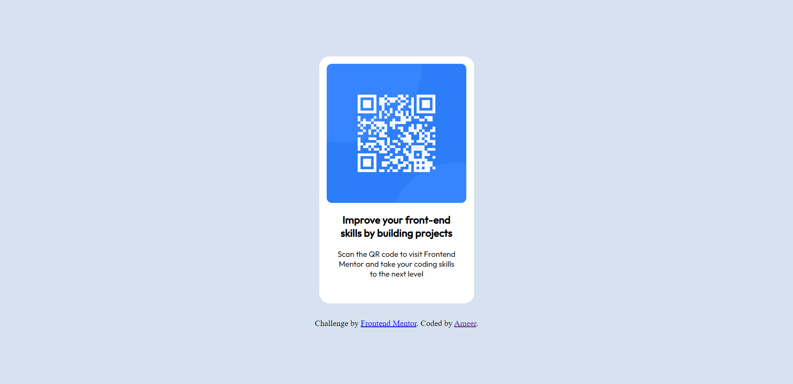
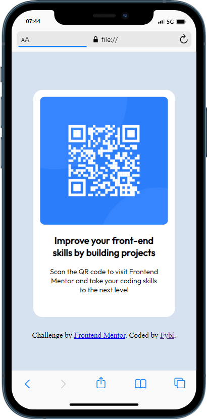

# Frontend Mentor - QR code component solution

This is a solution to the [QR code component challenge on Frontend Mentor](https://www.frontendmentor.io/challenges/qr-code-component-iux_sIO_H). Frontend Mentor challenges help you improve your coding skills by building realistic projects. 

## Table of contents

- [Overview](#overview)
  - [Screenshot](#screenshot)
  - [Links](#links)
- [My process](#my-process)
  - [Built with](#built-with)
  - [What I learned](#what-i-learned)
- [Author](#author)
- [Acknowledgments](#acknowledgments)

**Note: Delete this note and update the table of contents based on what sections you keep.**

## Overview
Recreating a QR Code screen; a challenge provided by Frontend Mentor. 

### Screenshot

### Links

- Solution URL: 
- Live Site URL: 

## My process

I started by breeaking down the project into components, then giving each one a class or an id with HTML. Then I moved on the CSS, styling each class from the top to the bottom. There were a few times I had to go back to an element at the top to modify something, but generally, I followed the top-to-bottom process. 

### Built with

- Semantic HTML5 markup
- CSS custom properties
- Flexbox
- CSS Grid

### What I learned

A new thing I learned with this challenge is how the "body" element has effects on all child elements, specifically the "height" attribute.

## Author

- Linktree - [Ameer "Fybi"](https://linktr.ee/chieffybi)
- Frontend Mentor - [@fybi](https://www.frontendmentor.io/profile/fybi)
- Twitter - [@0xFybi](https://www.twitter.com/0xFybi)

## Acknowledgments

Thanks to the moderators in the Frontend Mentor's Discord Community, who helped me figure out the little problems I came across.
